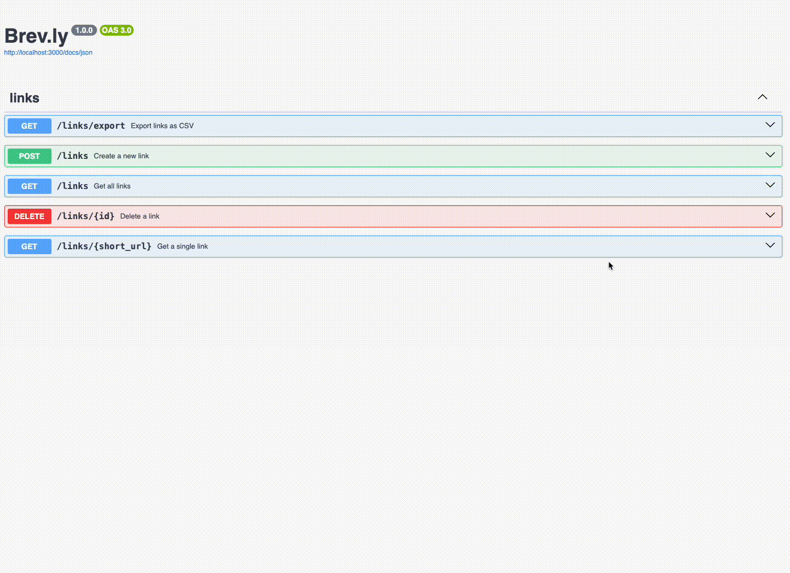
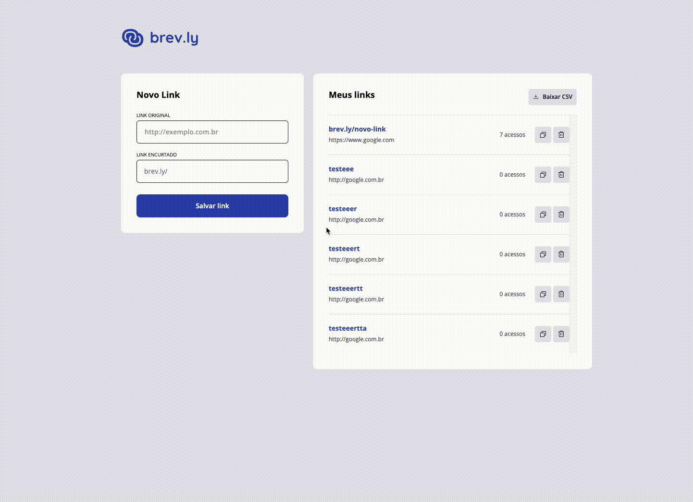
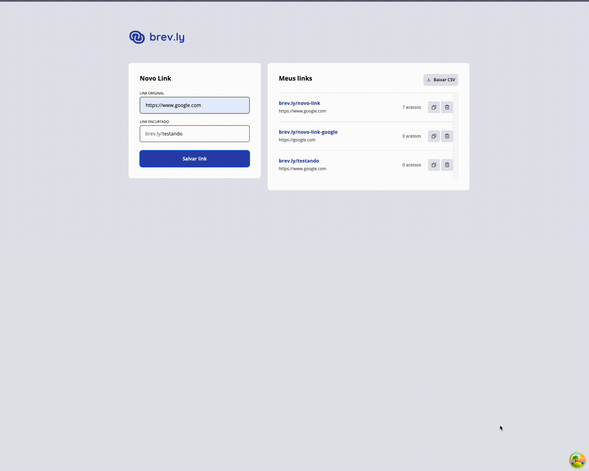
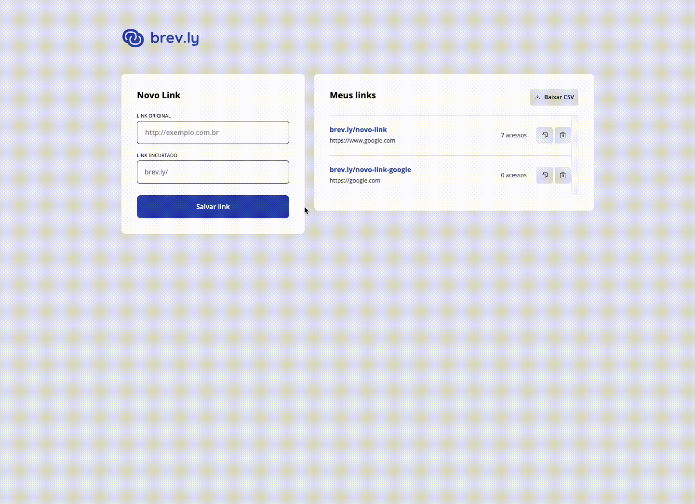
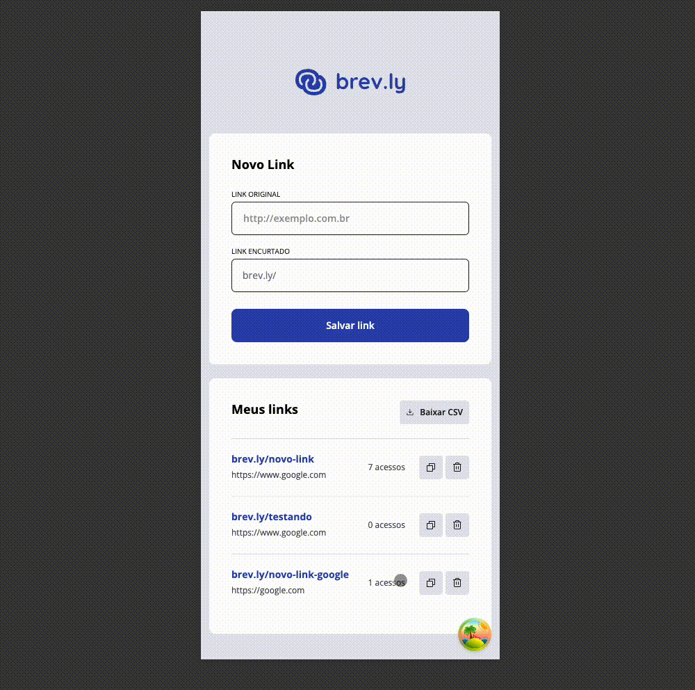

# Brev.ly

Projeto realizado como teste avaliativo da Rockeseat Pos FTR, tem como foco a criação de links encurtados para uso no dia a dia, ele contempla as apps em front e back end, abaixo teremos uma explicação básica das tecnologias e funções de cada e após uma demonstração funcional de tudo que foi utilizado

## Back-end

O servidor foi desenvolvido em **Node.js** com **Fastify**, utilizando **TypeScript** para maior segurança e clareza no código. Ele oferece as seguintes funcionalidades:

- **Criação de links encurtados**: Valida URLs e impede duplicações.
- **Deleção de links**: Remove links encurtados do banco de dados.
- **Redirecionamento**: Obtém a URL original a partir de um link encurtado.
- **Listagem de links**: Exibe todas as URLs cadastradas.
- **Exportação de links em CSV**: Gera relatórios performáticos com campos como URL original, URL encurtada, contagem de acessos e data de criação. O arquivo pode ser acessado via CDN.

### Tecnologias principais em Back

- **Fastify**: Framework para APIs rápidas e escaláveis.
- **Drizzle ORM**: Gerenciamento eficiente do banco de dados.
- **R2 Cloudfront**: Armazenamento de arquivos CSV.

## Front-end

A interface foi desenvolvida em **React** com **Vite**, priorizando responsividade e usabilidade. O usuário pode:

- **Criar links encurtados**: Interface simples e funcional.
- **Gerenciar links**: Listagem com estados de carregamento e mensagens de vazio.
- **Baixar relatórios CSV**: Botão dedicado para exportação de dados.
- **Redirecionamento automático**: Experiência fluida ao acessar links encurtados.

### Tecnologias principais em Front

- **React Query**: Gerenciamento de estado assíncrono.
- **TailwindCSS**: Estilização responsiva e moderna.
- **React Toastify**: Feedback visual para ações do usuário.

---

## Demonstração

Alguns videos de demonstração de eventos dentro do projeto, tudo rodando localmente em paralelo

### Docs Swagger

### Adicionando um link

### Redirect

### Cenários de Erro

### Mobile

### Download CSV

